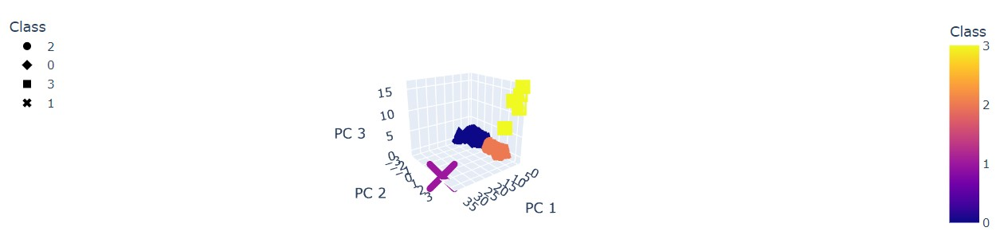

# Analyzing Cryptocurrencies using Unsupervised Machine Learning

## Overview

A dataset of cryptocurrencies will be analyzed using Unsupervised Machine Learning algorithms to discover trends in order to 
convince the firm Accountability Accounting to invest in these new currencies.  
The provided dataset has 1252 rows and it needs to be cleaned and encoded in order to use it for applying PCA.  
After the data was cleaned PCA was implemented so we can cluster the cryptocurrencies using K-Means. 
Finally the result was plotted in a 3D and 2D graph to visualize our results.

## Results 

#### Original Dataset

#### Cleaned Dataset

#### Implementing K-means

* Finding the number of clusters and then applying K-means to cluster the data

* DataFrame clustered

#### Plotting the tradable cryptocurrencies

